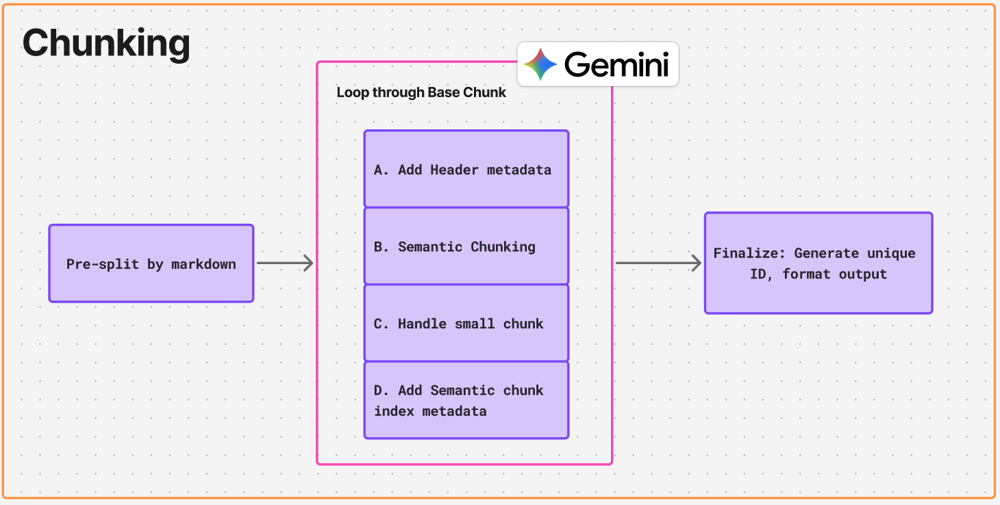

# Document Ingestion Context

This module wraps Docling with two custom adapters to improve text and image understanding during document conversion:

- Mistral OCR: recovers text from scanned PDFs or images (`src/document_extraction/infrastructure/adapter/ocr.py`).
- Mistral Picture Description: generates short, useful descriptions for figures and pictures (`src/document_extraction/infrastructure/adapter/picture_description.py`).

The pipeline decides when to run OCR, enriches pictures with descriptions, and serializes to Markdown with the descriptions preserved as HTML comments next to each image.

 
# Chunking Domain Services

This module converts Markdown into retrieval-ready chunks using a two-stage strategy:

- Markdown-aware pre-split: preserves `H1/H2/H3`, with adaptive sub-splitting for long sections (`src/document_chunking/infrastructure/markdown_splitter.py`).
- Semantic split: Gemini-powered `SemanticChunker` finds natural boundaries; tiny pieces are merged to meet a minimum size (`src/document_chunking/application/chunking_service.py`).

Outputs stable `id`, `text`, and rich `meta` (headers, source, indices) for each chunk.

# Knowledge Embedding & Store Contexts

Purpose
- Add dense embeddings to chunks using Gemini and load them into Milvus with hybrid (dense + BM25 sparse) indexing.
- Enforce simple dedup and upsert rules by `workspace_id`, `doc_hash`, and `doc_name`.
 
- Upsert rules (per workspace):
  - New content, new name → insert
  - Same content, new name → insert
  - New content, same name → delete old by name, then insert
  - Same content, same name → no‑op
  
- Knowledge embedding leverages the Gemini client in `src/knowledge_embedding/infrastructure/gemini_client.py` and normalizes chunk metadata via `src/knowledge_embedding/domain/services.py`.
- Milvus adapters live in `src/knowledge_store/infrastructure/milvus_store.py` with hybrid (dense + BM25 sparse) indexing for downstream retrieval.

