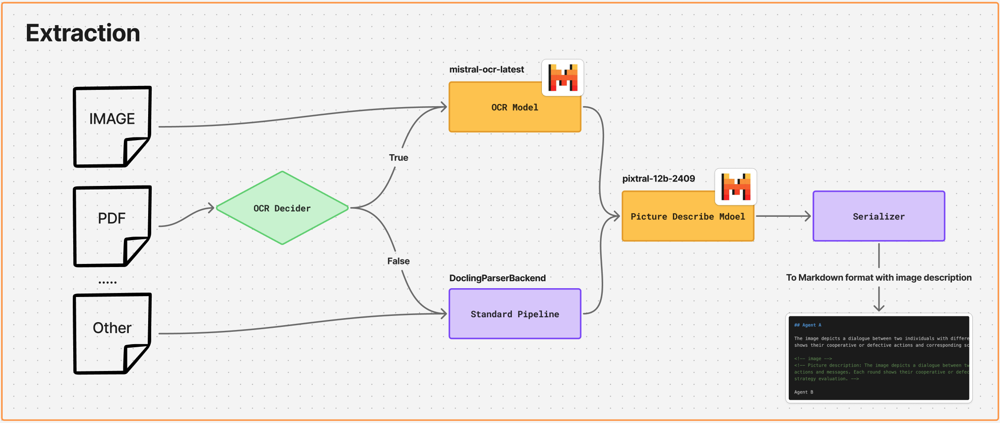

# Extraction Module

This module wraps Docling with two custom adapters to improve text and image understanding during document conversion:

- Mistral OCR: recovers text from scanned PDFs or images
- Mistral Picture Description: generates short, useful descriptions for figures and pictures

The pipeline decides when to run OCR, enriches pictures with descriptions, and serializes to Markdown with the descriptions preserved as HTML comments next to each image.



## Cite

- Extraction: Deep Search Team (2024). Docling Technical Report. arXiv:2408.09869. https://doi.org/10.48550/arXiv.2408.09869

# Chunking Module

The chunking pipeline is optimized for cost, speed, token-size control, and Thai-language support.

**Highlights**
- Cost/latency friendly: avoids double-embedding. Sentences are embedded once and chunk vectors are computed via weighted mean.
- Token-accurate sizing: uses `TokenTextSplitter` + `tiktoken` to enforce `MAX_TOKENS` and `OVERLAP_TOKENS` precisely.
- Thai-aware sentence splitting: leverages PyThaiNLP for Thai text and a lightweight regex splitter for general text.
- Structure-preserving: starts from `MarkdownHeaderTextSplitter` to keep H1/H2/H3 metadata with each chunk.
 
## Cite
- Embedding baseline: Arora, Liang, Ma (2017). A Simple but Tough-to-Beat Baseline for Sentence Embeddings. https://openreview.net/pdf?id=SyK00v5xx

# Embedding Module
 
 

```
@techreport{Docling,
  author = {Deep Search Team},
  month = {8},
  title = {Docling Technical Report},
  url = {https://arxiv.org/abs/2408.09869},
  eprint = {2408.09869},
  doi = {10.48550/arXiv.2408.09869},
  version = {1.0.0},
  year = {2024}
}

@inproceedings{arora2017simple,
  title = {A Simple but Tough-to-Beat Baseline for Sentence Embeddings},
  author = {Sanjeev Arora and Yingyu Liang and Tengyu Ma},
  booktitle = {Proceedings of the International Conference on Learning Representations},
  year = {2017},
  url = {https://openreview.net/pdf?id=SyK00v5xx}
}

@software{pythainlp,
    title = "{P}y{T}hai{NLP}: {T}hai Natural Language Processing in {P}ython",
    author = "Phatthiyaphaibun, Wannaphong  and
      Chaovavanich, Korakot  and
      Polpanumas, Charin  and
      Suriyawongkul, Arthit  and
      Lowphansirikul, Lalita  and
      Chormai, Pattarawat",
    doi = {10.5281/zenodo.3519354},
    license = {Apache-2.0},
    month = jun,
    url = {https://github.com/PyThaiNLP/pythainlp/},
    version = {v5.0.4},
    year = {2024},
}
```
