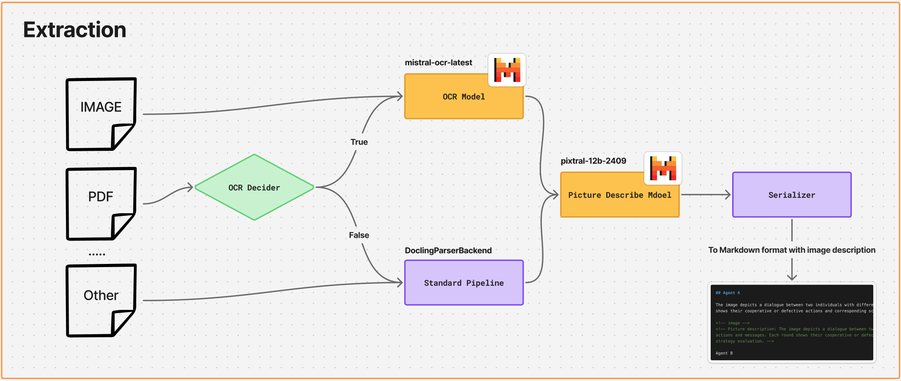

# Extraction Module

This module wraps Docling with two custom adapters to improve text and image understanding during document conversion:

- Mistral OCR: recovers text from scanned PDFs or images
- Mistral Picture Description: generates short, useful descriptions for figures and pictures

The pipeline decides when to run OCR, enriches pictures with descriptions, and serializes to Markdown with the descriptions preserved as HTML comments next to each image.



## Components

- Adapters
  - OCR: `MistralOcrModel` and `MistralOcrOptions` (see `src/extraction/adapter/ocr.py`); registered via `register_mistral_ocr_plugin(...)`.
  - Picture descriptions: `MistralPictureDescriptionModel` and `MistralPictureDescriptionOptions` (see `src/extraction/adapter/picture_description.py`); registered via `register_mistral_picture_description_plugin(...)`.
- OCR policy
  - `OcrPolicyDecider` samples the first N pages of a PDF to detect whether the embedded text layer is thin; if so, OCR is enabled (see `src/extraction/ocr_policy.py`).
- Pipeline options
  - Builders in `src/extraction/option/pipeline_option.py` create Docling `PipelineOptions` per format and wire the adapters (enable remote services, set models, timeouts, etc.).
- Serialization
  - `CommentPictureSerializer` extends Docling’s `MarkdownPictureSerializer` to append picture descriptions as HTML comments next to the image (see `src/extraction/picture_serializer.py`).

## Supported formats

Configured in `main.py` through Docling’s `DocumentConverter`:

- PDF, IMAGE, PPTX, DOCX, HTML, ASCIIDOC, CSV, MD
- PDFs: OCR is toggled by `OcrPolicyDecider.should_ocr(path)`
- Images: OCR is always enabled

## Quick start

1) Provide a Mistral API key

- Set in your environment or a `.env` file at repo root:

```
MISTRAL_KEY=sk-...your-key...
```

2) Run the demo conversion

```
python main.py
```

This reads the sample document from `data/Develop Process_QuantLab.pptx`, converts to Markdown, and writes the result to `output/Develop Process_QuantLab.md`.

## Usage (minimal example)

```python
from docling.document_converter import DocumentConverter, PdfFormatOption
from docling.datamodel.base_models import InputFormat

from extraction.adapter import (
    register_mistral_ocr_plugin,
    register_mistral_picture_description_plugin,
)
from extraction.option.pipeline_option import build_pdf_pipeline_options
from extraction.ocr_policy import OcrPolicyDecider
from extraction.picture_serializer import CommentPictureSerializer
from docling_core.transforms.serializer.markdown import MarkdownDocSerializer

mistral_key = "<your-mistral-key>"
source = "data/your.pdf"

policy = OcrPolicyDecider()
do_ocr = policy.should_ocr(source)
pdf_opts = build_pdf_pipeline_options(mistral_key, do_ocr=do_ocr)

register_mistral_ocr_plugin(allow_external_plugins=pdf_opts.allow_external_plugins)
register_mistral_picture_description_plugin(allow_external_plugins=pdf_opts.allow_external_plugins)

converter = DocumentConverter(
    allowed_formats=[InputFormat.PDF],
    format_options={InputFormat.PDF: PdfFormatOption(pipeline_options=pdf_opts)},
)

result = converter.convert(source)
serializer = MarkdownDocSerializer(
    doc=result.document,
    picture_serializer=CommentPictureSerializer(),
)
markdown = serializer.serialize().text
```

## Configuration

- OCR policy
  - `OcrPolicyDecider(sample_pages=5, char_threshold=200)` controls when PDFs are treated as scanned and passed to OCR.
- Picture description
  - Defaults: model `pixtral-12b`, short 2–3 sentence prompt, temperature `0.2`, `max_output_tokens=300`.
  - Conservative defaults for reliability: `concurrency=1`, `timeout_seconds=60.0` (see the `create_picture_description_options` helper).
- OCR
  - Model: `mistral-ocr-latest`.
- Remote services
  - `enable_remote_services=True` is set by the pipeline option builders; required for Mistral API calls.

## Cost tracking

- Runtime usage from the Mistral OCR and picture-description adapters is collected by `extraction.mistral_cost_tracker.mistral_cost_tracker`.
- Default pricing (October 2024 public list prices) is pre-configured for `pixtral-12b` and `mistral-ocr-latest`. Override them — or add more models — via the `MISTRAL_PRICE_OVERRIDES` environment variable. Example:

```
export MISTRAL_PRICE_OVERRIDES='{
  "chat": {
    "pixtral-12b": {
      "input_usd_per_million": 1.8,
      "output_usd_per_million": 5.4
    }
  },
  "ocr": {
    "mistral-ocr-latest": {"per_page_usd": 0.005}
  }
}'
```

- After each conversion `main.py` prints a human-readable summary with calls, tokens, pages processed, and estimated spend based on the provided pricing.

## Output

- Markdown is saved under `output/<source-stem>.md` in the example runner.
- Image descriptions are preserved as HTML comments right after each image block, e.g.:

```markdown

<!-- image description: A 2–3 sentence summary of the picture. -->
```

## Extensibility

- Swap models/providers by implementing Docling-compatible adapters and registering via Docling factories, similar to the Mistral adapters here.
- Adjust prompts, timeouts, and concurrency in the option builders to balance cost, speed, and robustness.
